---
title: hexo+github搭建可多设备同步的博客
---
首先需要配置好node.js和git环境，可输入如下检测：
```
node --version
```
```
git --version
```
检测结果如下图所示：
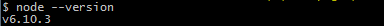
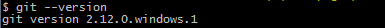
## 1. hexo的安装、环境配置及部署 ##
下面进行hexo的安装及环境配置。
1. 执行`npm install -g hexo-cli`命令，安装hexo，出现如下结果，表示hexo安装成功
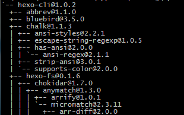
可用`hexo --version`命令检测，检测结果如下：
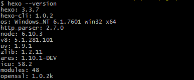
2. 新建文件夹hexo,进入该文件夹，在该文件夹内打开git bash命令窗口，执行`hexo init`命令，hexo随后自动在目标文件夹建立网站所需要的文件，出现下图所示结果表示配置完成
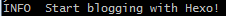
运行 `npm install` 会在hexo文件夹中安装node_modules。
3. 启动本地服务器
运行`hexo s`启动本地服务器，出现如下结果表明hexo server已经启动了，在浏览器中打开  [http://localhost:4000/](http://localhost:4000/)  ，这时可以看到Hexo已为你生成了一篇blog。
你可以按Ctrl+C 停止Server。
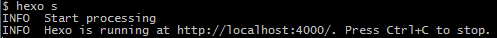
注意：如果出现上图结果但 [http://localhost:4000/](http://localhost:4000/)  始终无法打开，则是端口号4000被占用了，执行`hexo s -p 5000`修改端口号，此时打开网址 http://localhost:5000/ 看到如下结果表示本地博客搭建成功了。
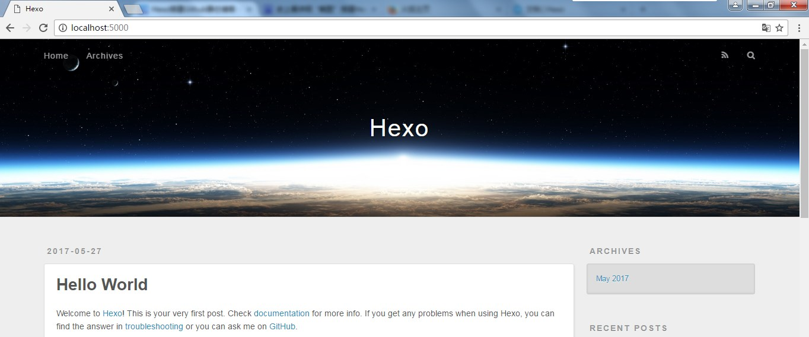
4. 部署到Github上
部署到Github前需要配置_config.yml文件，修改如下内容
```
deploy:
  type: github
  repository: git@github.com:zhchnchn/zhchnchn.github.io.git
  branch: master
```
设置SSH keys，在Git Bash中输入指令`ls -al ~/.ssh`，检查是否已经存在SSH keys如果存在的话直接删除.ssh文件夹里面所有文件：
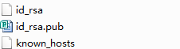
 输入指令
`ssh-keygen -t rsa -C "1413774769@qq.com"` 回车，提示输入passphrase，为了方便建议直接回车
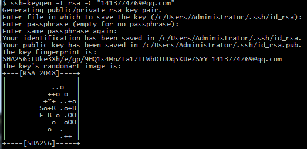
然后键入指令`ssh-agent -s`
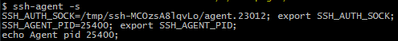
 继续输入指令`ssh-add ~/.ssh/id_rsa`
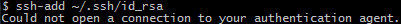
出现上图所示报错就输入如下指令
```
eval 'ssh-agent -s'` `ssh-add
```
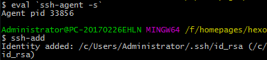
将SSH key添加到Github账户上。打开.ssh文件夹中的id_rsa.pub文件，复制全部内容，然后在Github中点击Settings
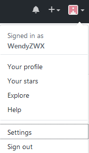
 选择左侧的点击，将复制的id_rsa.pub文件内容粘贴到Key文本框中
 点击add key，输入你的Github密码即可完成SSH Key的添加。输入命令`ssh -T git@github.com`测试，如果有警告，输入“yes”即可。
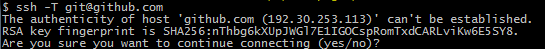
出现下图结构表明ssh key配置成功
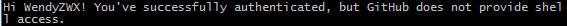
执行`hexo g`指令和`hexo d`指令完成部署，出现如下问题
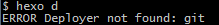
 时需要执行指令`npm install hexo-deployer-git --save`安装相应的插件。
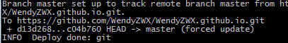
 出现上图所示结果表示Github上的部署完成了，此时博客搭建成功，在浏览器输入 https://WendyZWX.github.io 看到如下结果表明完成了博客在Github上的部署。
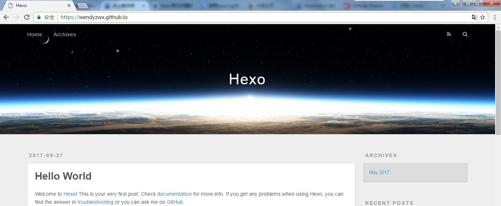
 

## 2. 如何实现多设备同步hexo搭建Github博客 ##
在Github仓库的master分支上是我们上传的博客文件，这个博客文件是不包含核心哦配置的。要实现多设备同步hexo搭建Github博客，我们需要新建分支，此处我们新建分支hexo，然后使用git命令将核心哦配置的Github工程文件上传到新建的分支上
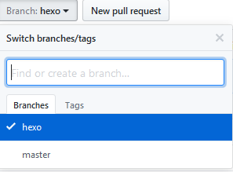
 在本地博客根目录下（本文中即指hexo文件夹）使用git指令上传项目到Github。
```
git init
git remote add origin https://github.com/用户名/仓库名.git
git checkout -b hexo//hexo为新建的分支名
git add --all
git commit -m "add hexo"
git push origin hexo
```
**注意**：此处我们可能出现报错
- 在执行`git add --all`时会出现hexo文件夹中的文件不能全部添加，此时使用`git add --all -f`将hexo中全部内容强制添加进去；
- 在执行`git push origin hexo`命令时会出现如下图所示报错
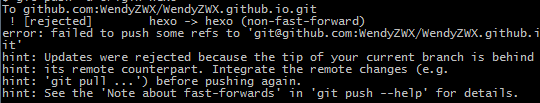
此时需要先执行`git pull origin hexo`命令，再执行`git push -u origin hexo`。如果出现 *packet_write_wait: Connection to 主机号 port 22: Broken pipe* 报错，则考虑是响应超时，按以下步骤添加或修改文件即可，亲测可行。
-  ~/.ssh文件夹（即存放SSH key的文件夹）中新建config文件（注意不要添加任何后缀名），在config文件中添加如下内容
```
Host *
	ServerAliveInterval 180
	ServerAliveCountMax 5
```
- 找到Git的安装目录，找到/etc/ssh/sshd_config文件，在其中后面添加如下内容
```
ClientAliveInterval 60
ClientAliveCountMax	5
```
打开/etc/ssh/ssh_config文件，在其中添加如下内容
```
TCPKeepAlive yes
```
此时执行`git push -u origin hexo -f`强推，即可将本地hexo文件同步到hexo分支中去。

在其他设备上clone下Github上新建的hexo分支中的文件到本地，在另一台设备上就可以使用在本地编辑博客并同步到Github上了。
```
// 克隆文件到本地
git clone -b 分支名 https://github.com/用户名/仓库名.git
```

